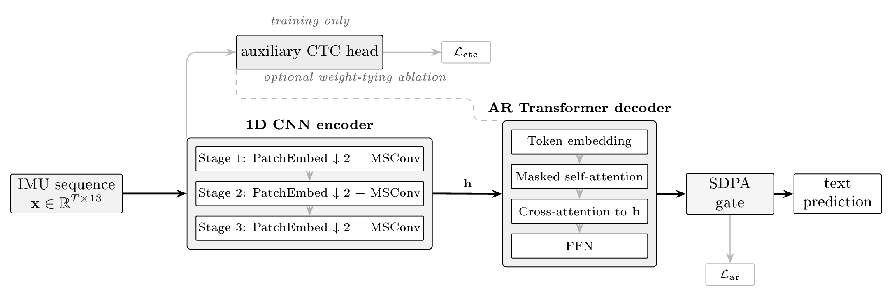

# HWRFormer

Official code release for
*"Mitigating Exposure Bias in IMU Handwriting Recognition with Noise Injection
and Hybrid CTC–AR Training"* (AALTD 2026, 11th Workshop on Advanced Analytics
and Learning on Temporal Data at ECML PKDD, Naples).

## Introduction

HWRFormer is an encoder–decoder recognizer for inertial-measurement-unit (IMU)
handwriting recognition: a 1D CNN encoder feeds an autoregressive (AR)
Transformer decoder with scaled-dot-product-attention (SDPA) output gating. The
paper studies two training-time interventions that mitigate exposure bias in the
AR decoder — **noise injection** and **hybrid CTC–AR training** — and contrasts
them against the recurrent CNN-BiLSTM-CTC baseline.



*HWRFormer architecture and hybrid training. At inference, the shared 1D CNN
encoder feeds the AR Transformer decoder, which consumes its own previous
predictions (dashed feedback loop); SDPA output gating is applied to the
attention outputs within each decoder layer, shown schematically at the decoder
output. During hybrid training, an auxiliary CTC head on the same encoder
(dashed, training only) adds an alignment loss summed with the AR loss.*

## Results

5-fold cross-validation on the **public** OnHW-words500 splits (writer-independent
and writer-dependent) and on the **private** Stabilo word/sentence splits from the
paper (aggregate numbers only — the private data itself is not released, see
Dataset). CER/WER in %, lower is better; **bold** = best per column.
MACs are reported at greedy AR decoding `len_max = 6`.

**Architecture migration — CTC baseline → HWRFormer.**

| Model | Obj. | Gating | WI CER | WI WER | WD CER | WD WER | #Params | MACs |
|---|---|---|---|---|---|---|---|---|
| REWI (CNN-BiLSTM) | CTC | — | 7.30 | 15.16 | 14.81 | 44.77 | 4.64M | **413M** |
| CNN-Transformer-CTC | CTC | — | 7.16 | 15.33 | **12.96** | 41.88 | 4.62M | 429M |
| HWRFormer | AR | ungated | 7.10 | **10.39** | 16.47 | 32.07 | 4.57M | 653M |
| HWRFormer | AR | elementwise | **6.94** | 10.50 | 16.31 | 31.87 | 4.64M | 669M |
| HWRFormer | AR | headwise | 6.99 | 10.47 | 15.70 | **31.08** | 4.57M | 667M |

Same migration on the **private** splits (CER / WER; params/MACs as above,
sentence profiling uses 4,096 input timesteps):

| Model | Obj. | Gating | Priv. (words) CER | Priv. (words) WER | Priv. (sent.) CER | Priv. (sent.) WER |
|---|---|---|---|---|---|---|
| REWI (CNN-BiLSTM) | CTC | — | **9.39** | 31.82 | **6.55** | 23.52 |
| CNN-Transformer-CTC | CTC | — | 9.53 | 33.81 | 7.41 | 29.13 |
| HWRFormer | AR | ungated | 10.59 | 21.39 | 10.37 | 16.73 |
| HWRFormer | AR | elementwise | 9.96 | **19.04** | 9.28 | **14.88** |
| HWRFormer | AR | headwise | 9.63 | 19.07 | 9.12 | 14.96 |

AR decoding halves WER on the private splits too, while REWI keeps the best
CER there — the CER/WER trade-off discussed in the paper.

**Exposure-bias interventions** (CER / WER). HWRFormer is the elementwise-gated
AR variant from the migration tables; "+" rows add the labeled training
intervention on top. **Bold** = best per dataset and metric.

| Model | OnHW (WI) | OnHW (WD) | Priv. (words) | Priv. (sent.) |
|---|---|---|---|---|
| REWI | 7.30 / 15.16 | 14.81 / 44.77 | 9.39 / 31.82 | **6.55** / 23.52 |
| HWRFormer | 6.94 / 10.50 | 16.31 / 31.87 | 9.96 / **19.04** | 9.28 / **14.88** |
| + Noise inj. | 6.86 / 13.04 | 13.52 / 35.98 | **7.79** / 23.39 | 7.09 / 18.83 |
| + Hybrid | 6.83 / **10.17** | 13.39 / **27.42** | 9.37 / 19.65 | 9.38 / 16.98 |
| + Hybrid + Noise inj. | **6.70** / 12.93 | **11.49** / 31.72 | 7.85 / 24.88 | 9.73 / 27.52 |

OnHW WI fold difficulty varies strongly across writers (individual folds range
from ~1 to ~15 % CER), so sub-percentage-point differences on WI are within
fold noise. The paper reports the full 5-fold mean ± std; `evaluate.py`
regenerates both. See the "Reproducing paper experiments" table below.

**Direct exposure-bias probe** (CER, %; 5-fold mean). Each saved checkpoint is
decoded with teacher forcing (**w/ TF**: ground-truth prefix at every step) and
without (**w/o TF**: greedy decoding that feeds its own prediction back in, the
inference path used in the tables above). **Gap red.** is the percentage by
which a training intervention shrinks the `w/o TF − w/ TF` gap relative to plain
HWRFormer on that split — higher means more of the exposure-bias gap removed.
✓ marks the active intervention; the first row is plain HWRFormer (AR). Largest
reduction per split in **bold**.

| Noise | Hybrid | WI w/ TF | WI w/o TF | WI Gap red. | WD w/ TF | WD w/o TF | WD Gap red. |
|:-:|:-:|--:|--:|--:|--:|--:|--:|
|   |   | 2.76 | 6.95 | 0.0% | 10.91 | 16.31 | 0.0% |
| ✓ |   | 5.23 | 6.86 | 61.1% | 11.76 | 13.52 | 67.4% |
|   | ✓ | 2.77 | 6.83 | 3.1% | 9.86 | 13.38 | 34.8% |
| ✓ | ✓ | 5.33 | 6.70 | **67.3%** | 10.33 | 11.48 | **78.7%** |

Same probe on the **private** splits:

| Noise | Hybrid | Words w/ TF | Words w/o TF | Words Gap red. | Sent. w/ TF | Sent. w/o TF | Sent. Gap red. |
|:-:|:-:|--:|--:|--:|--:|--:|--:|
|   |   | 5.23 | 9.96 | 0.0% | 2.73 | 9.28 | 0.0% |
| ✓ |   | 6.52 | 7.80 | 72.9% | 4.62 | 7.09 | **62.3%** |
|   | ✓ | 5.13 | 9.37 | 10.4% | 3.30 | 9.38 | 7.2% |
| ✓ | ✓ | 6.64 | 7.85 | **74.4%** | 7.20 | 9.73 | 61.4% |

Noise injection removes most of the exposure-bias gap on every split
(61.1 % WI, 67.4 % WD, 72.9 % private words, 62.3 % private sentences), while
hybrid CTC–AR alone changes it far less (3.1–34.8 %), consistent with its role
as an encoder-side regularizer. Reproduce with `eval_tf_gap.py` (see the
Evaluation section); the private splits require the non-released Stabilo data.

## Installation

```bash
conda create -n hwrformer python=3.10
conda activate hwrformer
pip install -r requirements.txt
export REPO=$(pwd)        # configs reference ${REPO} for dataset / output paths
```

## Dataset

For commercial reasons, the private IMU-pen datasets used for cross-dataset
confirmation in the paper are not published. Alternatively, the **public**
OnHW-words500 dataset can be used for training and evaluation; the paper's
primary benchmark is its right-handed writer-independent subset. Download it
from the Fraunhofer IIS OnHW release:
<https://www.iis.fraunhofer.de/de/ff/lv/dataanalytics/anwproj/schreibtrainer/onhw-dataset.html>

We use a MSCOCO-like structure (`train.json` / `val.json` + per-sample CSVs).
The `onhw.ipynb` notebook converts the official OnHW release into this
structure and must be run **twice** — once per split:

1. Extract the OnHW download. You need the two right-handed words500
   variants: `Words500_indep_R` (writer-independent) and `Words500_dep_R`
   (writer-dependent). Each contains the five official fold directories with
   the released pickle files (`all_x_dat_{train,val}_imu.pkl`,
   `all_{train,val}_gt.pkl`, `{train,val}_ids.pkl`).
2. Open `onhw.ipynb` (e.g. `jupyter lab` inside the `hwrformer` env) and set
   the three variables at the top of the first code cell:

   | Run | `dir_raw` | `dir_out` | `writer_indep` |
   |---|---|---|---|
   | WI | `<extracted>/Words500_indep_R` | `${REPO}/data/onhw_wi_word_rh` | `True` |
   | WD | `<extracted>/Words500_dep_R` | `${REPO}/data/onhw_wd_word_rh` | `False` |

3. Run all cells. Per official fold, the notebook reads the OnHW pickles,
   drops empty sequences and sequences longer than 1,024 timesteps, writes one
   13-channel CSV per sample, and builds `train.json` / `val.json` with the
   5-fold annotations and the character categories.

The result (all preprocessing included — the training code applies
normalization and augmentation at load time, and the official OnHW fold
boundaries are preserved unchanged):

```
${REPO}/data/onhw_wi_word_rh/   # writer-independent words
├── train.json                  # per-fold annotations (label, filename, writer id)
├── val.json
└── data/<fold>/{train,val}/*.csv
${REPO}/data/onhw_wd_word_rh/   # writer-dependent words (same layout)
```

## Training

Edit `configs/train.yaml` (it documents every knob inline) and run 5-fold
cross-validation with a single command — `train_cv.py` generates one config per
fold, runs `main.py` on each sequentially, and cleans up afterwards:

```bash
python train_cv.py -c configs/train.yaml
```

To train a single fold instead, set `idx_fold` to `0..4` in the config and call
`main.py` directly:

```bash
python main.py -c configs/train.yaml
```

Training uses 300 epochs, AdamW, a linear-warmup/cosine schedule (30 warmup
epochs), and batch size 64. Each fold writes to `<dir_work>/<fold>/`.

`configs/others/` holds ready-to-run examples for the other regimes:

| Config | Model |
|---|---|
| `configs/train.yaml` | HWRFormer (AR + elementwise SDPA gating) — the headline model |
| `configs/others/train_rewi_ctc.yaml` | CNN-BiLSTM-CTC baseline (REWI) |
| `configs/others/train_transformer_ctc.yaml` | Parameter-matched CNN-Transformer-CTC |
| `configs/others/train_noise_injection.yaml` | AR + noise injection |
| `configs/others/train_hybrid.yaml` | Hybrid CTC–AR |

### Reproducing paper experiments

Every paper result is a knob change on one of the configs above. Start from the
listed base config, apply the override, set `dir_work` to the group shown (so
results land where the figure scripts expect them), and run `train_cv.py`. Swap
`onhw_wi_word_rh` → `onhw_wd_word_rh` in `dir_dataset` and `dir_work` for the
writer-dependent split.

| Experiment | Base config | Knob override | `dir_work` group (under `${REPO}/results/hwr2/`) |
|---|---|---|---|
| AR baseline (elementwise) | `train.yaml` | *(defaults)* | `Baseline-AR-blconv_b/ar_transformer__onhw_wi_word_rh` |
| AR, no gating | `train.yaml` | `use_gated_attention: false` | `Baseline-AR-Ungated/ar_transformer__onhw_wi_word_rh` |
| AR, headwise gating | `train.yaml` | `gating_type: headwise` | `Baseline-AR-HeadwiseGating/ar_transformer__onhw_wi_word_rh` |
| CNN-Transformer-CTC | `others/train_transformer_ctc.yaml` | *(as given)* | `Baseline-Transformer-CTC-Matched/transformer__onhw_wi_word_rh` |
| CNN-BiLSTM-CTC (REWI) | `others/train_rewi_ctc.yaml` | *(as given)* | `blconv_bilstm_wide_no_tokenizer/bilstm_wide__onhw_wi_word_rh` |
| Noise-injection mode | `others/train_noise_injection.yaml` | `noise_injection.mode:` `uniform` \| `bigram_left` \| `bigram_right` \| `self_confusion` \| `adjacent_swap` | `Baseline-AR-NoiseInjection-<mode>/ar_transformer__onhw_wi_word_rh` |
| Noise-injection rate sweep | `others/train_noise_injection.yaml` | `noise_injection.p_replace:` `0.05` \| `0.10` \| `0.15` \| `0.20` \| `0.30` | `Baseline-AR-NoiseInjection-Sweep-blconv_b/ar_transformer__onhw_wi_word_rh__p0p<NN>` |
| Hybrid λ sweep | `others/train_hybrid.yaml` | `dual_head.lambda_ctc:` `0.1 … 1.0` | `train_element_word_hybrid_<NN>_onhw_wi/ar_transformer__onhw_wi_word_rh` |
| Hybrid weight-tying | `others/train_hybrid.yaml` | `dual_head.tie.ctc_to_ar_outproj: true` | `train_element_word_hybrid_<NN>_onhw_wi_ctc_to_ar_outproj/ar_transformer__onhw_wi_word_rh` |
| Hybrid + noise injection | `others/train_hybrid.yaml` + `noise_injection` block | both blocks (λ=0.1) | `HybridNoiseInjection_<mode>/ar_transformer__onhw_wi_word_rh` |
| Exposure-bias probe (Table 4) | any saved fold checkpoint | *(no training; run `eval_tf_gap.py`, see Evaluation)* | writes `eval_tf_gap.json` next to the fold's `train.yaml` |

`self_confusion` additionally needs per-fold confusion matrices at
`noise_injection.confusion_path`; the other noise-injection modes are
self-contained (the bigram table is built from the training labels at runtime).

## Evaluation

The 5-fold means are produced directly by training. To aggregate them (5-fold
mean ± std CER/WER plus parameter counts and MACs via `FlopCounterMode`):

```bash
python evaluate.py -c configs/train.yaml
```

To re-score a single trained checkpoint, edit `configs/test.yaml` (`checkpoint`,
`idx_fold`) and run `python main.py -c configs/test.yaml`.

**Direct exposure-bias probe (Table 4).** For a saved fold checkpoint, run

```bash
python eval_tf_gap.py -c <dir_work>/<fold>/<fold>/train.yaml \
    --checkpoint <dir_work>/<fold>/<fold>/checkpoints/best_cer.pth
```

to compute teacher-forced (w/ TF) vs.\ greedy decoding without teacher forcing
(w/o TF) on the same checkpoint. The script writes `eval_tf_gap.json` next to
the YAML, with per-condition CER/WER and the w/ TF → w/o TF gap. Sweeping
across all folds and training conditions reproduces Table 4 of the paper.

The paper's figures can be regenerated without re-running training — the
scripts use trained results under `results/hwr2/` when present and otherwise
fall back to the pre-aggregated numbers in `HWRFormer.json`. Output PDFs land
in `figures/`:

```bash
python analysis/scripts/plot_noise_injection_modes_bars.py    # Fig. 2: noise-injection mode bars
python analysis/scripts/plot_noise_injection_p_sweep.py       # Fig. 3: p_ni rate-sweep curves
python analysis/scripts/plot_lambda_sweep.py                  # Fig. 4: lambda_ctc sweep
```

## Repository layout

```
main.py                 # train / evaluate one fold
train_cv.py             # run all cross-validation folds sequentially
evaluate.py             # 5-fold aggregation + params/MACs
eval_tf_gap.py          # direct exposure-bias probe (w/ TF vs. w/o TF, Table 4)
onhw.ipynb              # OnHW -> MSCOCO-like dataset conversion
hwrformer/              # core library
  model/                #   1D CNN encoder, AR Transformer decoder, CNN-Transformer-CTC,
                        #   hybrid dual-head, SDPA gating
  dataset/              #   IMU loaders, augmentations, collation
  training/             #   train/eval loops (CTC, AR, hybrid, noise injection)
  analysis/             #   metrics + encoder-feature analysis
  ctc_decoder.py        #   CTC best-path decoder
configs/                # train.yaml, test.yaml, others/ (see Training)
analysis/scripts/       # table + figure regeneration scripts
figures/                # architecture figure used in this README
HWRFormer.json          # pre-aggregated 5-fold means for the paper's tables/figures
requirements.txt        # Python dependencies
LICENSE.txt             # MIT
```

## License

MIT — see `LICENSE.txt`.

## Citation

```bibtex
@inproceedings{ajlal2026hwrformer,
  title     = {Mitigating Exposure Bias in {IMU} Handwriting Recognition with
               Noise Injection and Hybrid {CTC}--{AR} Training},
  author    = {Ajlal, Muhammad and Li, Jindong and Christlein, Vincent and
               Zanca, Dario and Eskofier, Bj{\"o}rn},
  booktitle = {ECML PKDD Workshops: 11th Workshop on Advanced Analytics and
               Learning on Temporal Data (AALTD)},
  year      = {2026},
}
```
